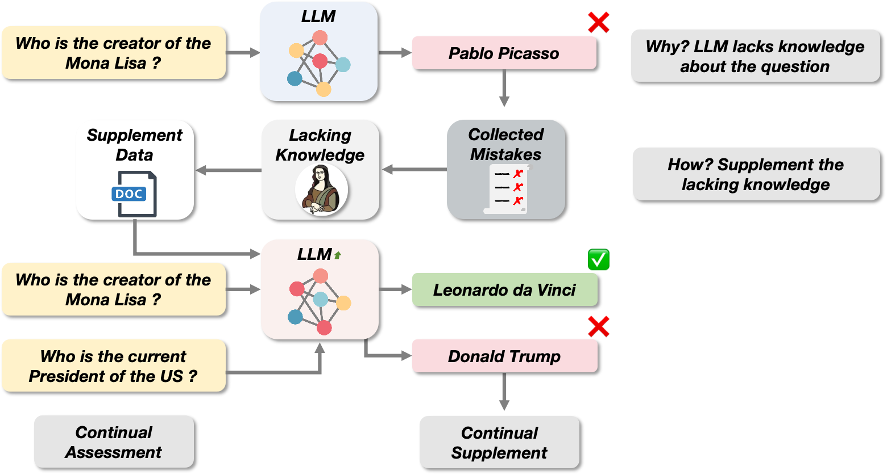

### 🌟 Abstract
Large Language Models (LLMs) demonstrate remarkable performance in a variety of downstream tasks, but may still generate incorrect responses in certain scenarios due to the knowledge deficiencies and the flawed pre-training data. Continual Learning (CL) is a common used method to tackle this issue. Traditional CL is task-oriented, employing novel or factually accurate data to retrain LLMs from scratch. But this method requires more training data related to the task and expensive training costs. To address this challenge, inspired by the "summarize mistakes" learning skill, we propse the Continue Envolving from mistakes (CEM) method to achieve iterative refinement of LLM. Specifically, the LLM's incorrect responses indicate knowledge deficiencies related to the questions, so we collect corpora with these knowledge from multiple data sources followed by iterative supplemental training for continuous, targeted knowledge updating and supplementation. Meanwhile, we devised two strategies for constructing supplementary training sets to to augment the LLM's comprehension of the corpus and to mitigate catastrophic forgetting. We conduct extensive experiments to validate the effect of this CL method, and in the best case, our method resulted in a 17.00\% improvement in the accuracy of the LLM.

