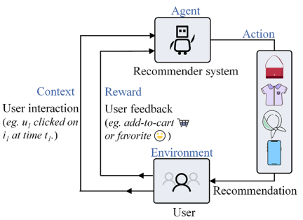

### 🌟Abstract
Recommender systems still face a trade-off between exploring new items to maximize user satisfaction and exploiting those already interacted with to match user interests. This problem is widely recognized as the exploration/exploitation (EE) dilemma, and the multi-armed bandit (MAB) algorithm has proven to be an effective solution. As the scale of users and items in real-world application scenarios increases, their purchase interactions become sparser. Then three issues need to be investigated when building MAB-based recommender systems. First, large-scale users and sparse interactions increase the difficulty of user preference mining. Second, traditional bandits model items as arms and cannot deal with ever-growing items effectively. Third, widely used Bernoulli-based reward mechanisms only feedback 0 or 1, ignoring rich implicit feedback such as behaviors like click and add-to-cart. To address these problems, we propose an algorithm named Dynamic Clustering based Contextual Combinatorial Multi-Armed Bandits (DC<sup>3</sup>MAB), which consists of three configurable key components. Specifically, a dynamic user clustering strategy enables different users in the same cluster to cooperate in estimating the expected rewards of arms. A dynamic item partitioning approach based on collaborative filtering significantly reduces the scale of arms and produces a recommendation list instead of one item to provide diversity. In addition, a multi-class reward mechanism based on fine-grained implicit feedback helps better capture user preferences. Extensive empirical experiments on three real-world datasets demonstrate the superiority of our proposed DC<sup>3</sup>MAB over state-of-the-art bandits (On average, **+75.8%** in F1 and **+54.3%** in cumulative reward). The source code is available at [https://github.com/HaixHan/DC3MAB](https://unsplash.com).


### 🌟 Full Paper
If you want to read the full paper, plese click the following button👇🏻

[](https://www.sciencedirect.com/science/article/pii/S0950705122010206)


### Did you find this work helpful? Consider Citing it 🙌
If you find this work is interesting, please consider citing our work as follows:

```
@article{yan2022dynamic,
  title={Dynamic clustering based contextual combinatorial multi-armed bandit for online recommendation},
  author={Yan, Cairong and Han, Haixia and Zhang, Yanting and Zhu, Dandan and Wan, Yongquan},
  journal={Knowledge-Based Systems},
  volume={257},
  pages={109927},
  year={2022},
  publisher={Elsevier}
}
```


