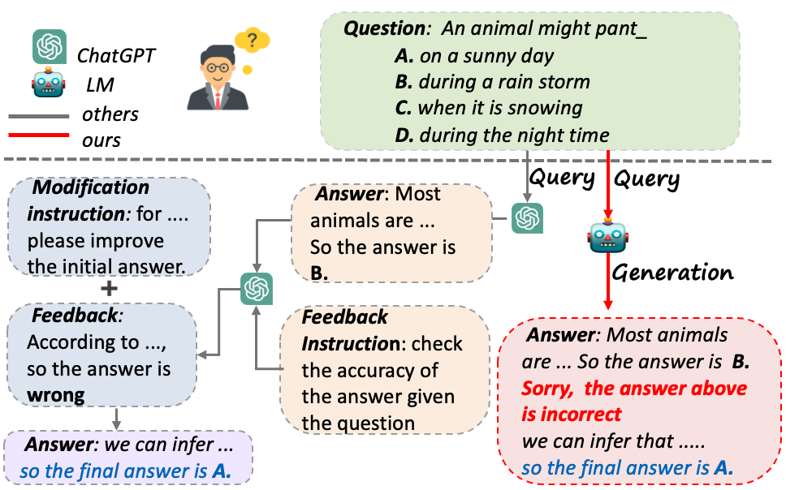

### Abstract
Generative Language Models (LMs) such as ChatGPT have exhibited remarkable performance across various downstream tasks. Nevertheless, one of their most prominent drawbacks is generating inaccurate or false information with a confident tone. Previous studies have devised sophisticated pipelines and prompts to induce large LMs to exhibit the capability for self-correction. However, large LMs are explicitly prompted to verify and modify their answers separately rather than completing all steps spontaneously like humans. Moreover, these complex prompts are extremely challenging for small LMs to follow. In this paper, we introduce the Intrinsic Self-Correction (ISC) in generative language models, aiming to correct the initial output of LMs in a self-triggered manner, even for those small LMs with 6 billion parameters. Specifically, we devise a pipeline for constructing self-correction data and propose Partial Answer Masking (PAM), aiming to endow the model with the capability for intrinsic self-correction through fine-tuning. We conduct experiments using LMs with parameters sizes ranging from 6 billion to 13 billion in two tasks, including commonsense reasoning and factual knowledge reasoning. Our experiments demonstrate that the outputs generated using ISC outperform those generated without self-correction. We believe that the output quality of even small LMs can be further improved by empowering them with the ability to intrinsic self-correct.



## Did you find this page helpful? Consider sharing it 🙌


<!-- ## Mindmaps

Hugo Blox supports a Markdown extension for mindmaps.

With this open format, can even edit your mindmaps in other popular tools such as Obsidian.

Simply insert a Markdown code block labelled as `markmap` and optionally set the height of the mindmap as shown in the example below.

Mindmaps can be created by simply writing the items as a Markdown list within the `markmap` code block, indenting each item to create as many sub-levels as you need:

<div class="highlight">
<pre class="chroma">
<code>
```markmap {height="200px"}
- Hugo Modules
  - Hugo Blox
  - blox-plugins-netlify
  - blox-plugins-netlify-cms
  - blox-plugins-reveal
```
</code>
</pre>
</div>

renders as

```markmap {height="200px"}
- Hugo Modules
  - Hugo Blox
  - blox-plugins-netlify
  - blox-plugins-netlify-cms
  - blox-plugins-reveal
```

Anh here's a more advanced mindmap with formatting, code blocks, and math:

<div class="highlight">
<pre class="chroma">
<code>
```markmap
- Mindmaps
  - Links
    - [Hugo Blox Docs](https://docs.hugoblox.com/)
    - [Discord Community](https://discord.gg/z8wNYzb)
    - [GitHub](https://github.com/HugoBlox/hugo-blox-builder)
  - Features
    - Markdown formatting
    - **inline** ~~text~~ *styles*
    - multiline
      text
    - `inline code`
    -
      ```js
      console.log('hello');
      console.log('code block');
      ```
    - Math: $x = {-b \pm \sqrt{b^2-4ac} \over 2a}$
```
</code>
</pre>
</div>

renders as

```markmap
- Mindmaps
  - Links
    - [Hugo Blox Docs](https://docs.hugoblox.com/)
    - [Discord Community](https://discord.gg/z8wNYzb)
    - [GitHub](https://github.com/HugoBlox/hugo-blox-builder)
  - Features
    - Markdown formatting
    - **inline** ~~text~~ *styles*
    - multiline
      text
    - `inline code`
    -
      ```js
      console.log('hello');
      console.log('code block');
      ```
    - Math: $x = {-b \pm \sqrt{b^2-4ac} \over 2a}$
```

## Highlighting

<mark>Highlight</mark> important text with `mark`:

```html
<mark>Highlighted text</mark>
```

## Callouts

Use [callouts](https://docs.hugoblox.com/reference/markdown/#callouts) (aka _asides_, _hints_, or _alerts_) to draw attention to notes, tips, and warnings.

By wrapping a paragraph in `{} ... {}`, it will render as an aside.

```markdown
{}
A Markdown aside is useful for displaying notices, hints, or definitions to your readers.
{}
```

renders as

{}
A Markdown aside is useful for displaying notices, hints, or definitions to your readers.
{}

Or use the `warning` callout type so your readers don't miss critical details:

{}
A Markdown aside is useful for displaying notices, hints, or definitions to your readers.
{} -->


