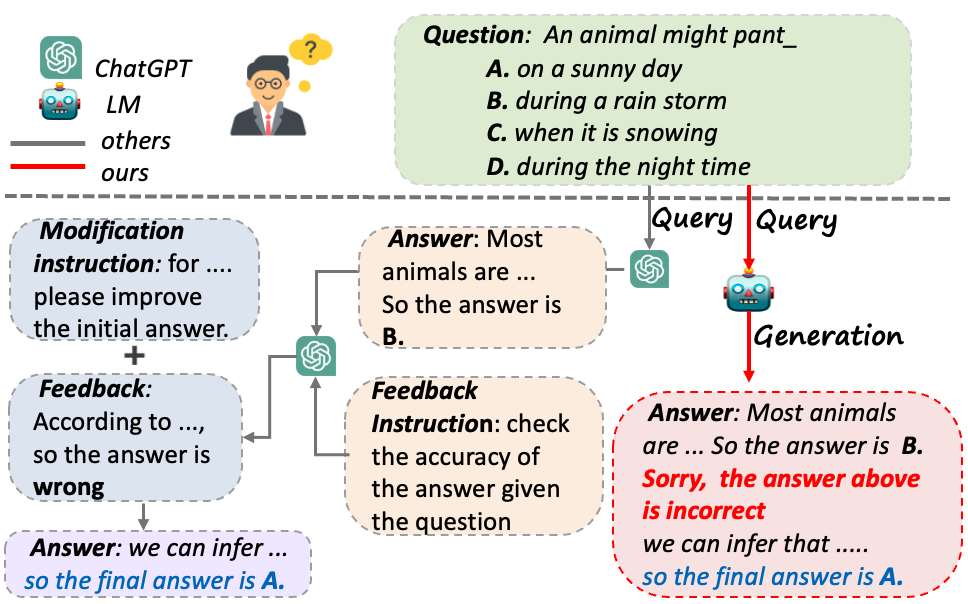

### 🌟 Abstract
Generative Language Models (LMs) such as ChatGPT have exhibited remarkable performance across various downstream tasks. Nevertheless, one of their most prominent drawbacks is generating inaccurate or false information with a confident tone. Previous studies have devised sophisticated pipelines and prompts to induce large LMs to exhibit the capability for self-correction. However, large LMs are explicitly prompted to verify and modify their answers separately rather than completing all steps spontaneously like humans. Moreover, these complex prompts are extremely challenging for small LMs to follow. In this paper, we introduce the Intrinsic Self-Correction (ISC) in generative language models, aiming to correct the initial output of LMs in a self-triggered manner, even for those small LMs with 6 billion parameters. Specifically, we devise a pipeline for constructing self-correction data and propose Partial Answer Masking (PAM), aiming to endow the model with the capability for intrinsic self-correction through fine-tuning. We conduct experiments using LMs with parameters sizes ranging from 6 billion to 13 billion in two tasks, including commonsense reasoning and factual knowledge reasoning. Our experiments demonstrate that the outputs generated using ISC outperform those generated without self-correction. We believe that the output quality of even small LMs can be further improved by empowering them with the ability to intrinsic self-correct.



### 🌟 Full Paper 

- Paper PDF 👇:
<a href="https://arxiv.org/abs/2401.07301"></a>
- Paper PPT 👇：
<a href="./10260_PPT.pdf"></a>
- Paper Poster 👇：
<a href="./10260_poster.pdf"></a>


###  🙌 Consider Citing it
```
@INPROCEEDINGS{haixiaHan,
  author={Haixia Han, Jiaqing Liang, Jie Shi, Qianyu He and Yanghua Xiao},
  booktitle={2Proceedings of the 38th AAAI Conference on Artificial Intelligence(AAAI)}, 
  title={Small Language Model Can Self-Correct}, 
  year={2024},
  pages={X-Y},
}
```