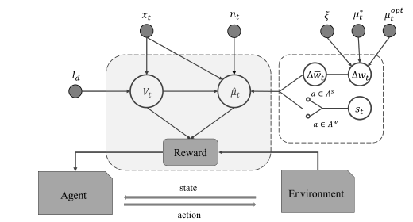

### 🌟Abstract
Contextual bandits efficiently solve the exploration and exploitation (EE) problem in online recommendation tasks. Most existing contextual bandit algorithms utilize a fixed reward mechanism, which makes it difficult to accurately capture the preference changes of users in non-stationary environments, thus affecting recommendation performance. In this paper, we formalize the online recommendation task as a contextual bandit problem and propose a Thompson sampling algorithm with time-varying reward (TV-TS) that captures user preference changes from three perspectives: (1) forgetting past preferences based on a functional decay method while capturing possible periodic demands, (2) mining fine-grained preference changes from multi-behavioral implicit feedback, and (3) iterating the reward weights adaptively. We also provide theoretical regret analysis to demonstrate the sublinearity of the algorithm. Extensive empirical experiments on two real-world datasets show that our proposed algorithm outperforms state-of-the-art time-varying bandit algorithms. Furthermore, the designed reward mechanism can be flexibly configured to other bandit algorithms to improve them.

### 🌟 Full Paper
If you want to read the full paper, plese click the following button👇🏻
<!-- - block: buttons
    content:
      buttons:
        - title: PDF
          icon: arxiv
          url: https://link.springer.com/chapter/10.1007/978-3-031-30672-3_4 -->
<!--  -->

### Did you find this work helpful? Consider Citing it 🙌
If you find this work is interesting, please consider citing our work as follow:

'''
@inproceedings{yan2023thompson,
  title={Thompson Sampling with Time-Varying Reward for Contextual Bandits},
  author={Yan, Cairong and Xu, Hualu and Han, Haixia and Zhang, Yanting and Wang, Zijian},
  booktitle={International Conference on Database Systems for Advanced Applications},
  pages={54--63},
  year={2023},
  organization={Springer}
}
'''

